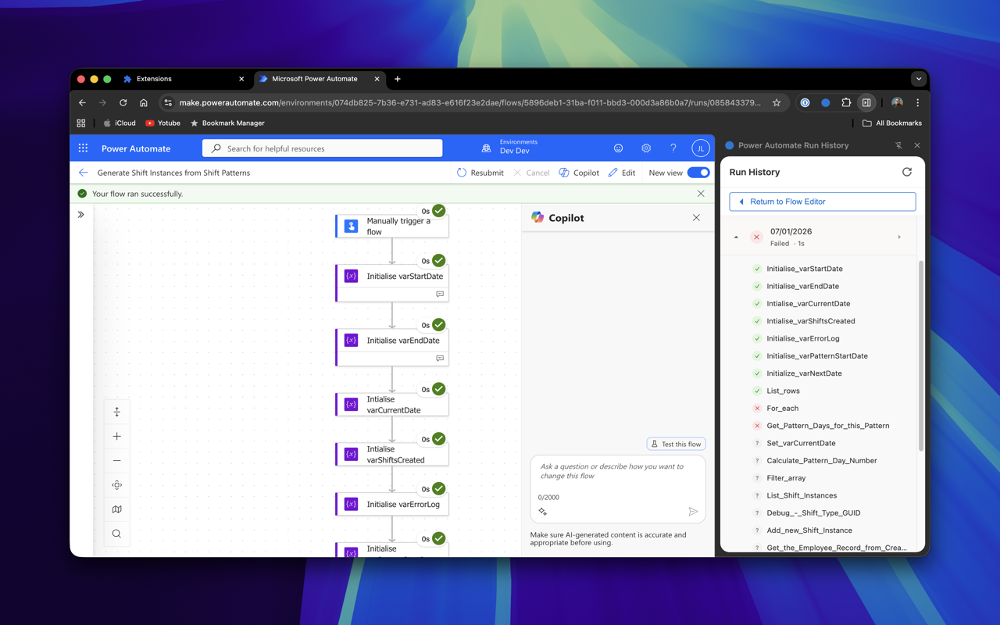

# Flow Run Buddy

<p align="center">
  
</p>

A Chrome extension that displays run history for Power Automate Cloud Flows directly from the flow designer.

## Screenshots

<p align="center">
  
</p>

<p align="center">
  
</p>

<p align="center">
  
</p>

## Features

- **Side panel UI** - View run history alongside the flow designer
- **Last 10 runs** - Quick access to recent flow executions
- **Run details** - Status, timestamp, and duration for each run
- **Expandable steps** - Click to expand any run and see individual action results
- **One-click navigation** - Click any run to view its full details
- **Double-click to open** - Double-click a run row to navigate to run details
- **Return to editor** - Quick button to return to the flow editor after viewing a run
- **Auto-detection** - Automatically detects when you're viewing a flow
- **Power Apps support** - Detects flows opened in Power Apps and offers redirect to Power Automate

## Installation

1. Clone or download this repository
2. Open Chrome and navigate to `chrome://extensions/`
3. Enable **Developer mode** (toggle in top right)
4. Click **Load unpacked**
5. Select the extension folder

## Usage

1. Navigate to a Power Automate flow in the designer at `make.powerautomate.com`
2. Click the extension icon in the toolbar to open the side panel
3. View the run history for the current flow
4. Click the expand button (▼) on any run to see individual step results
5. Double-click a run or click the chevron (›) to navigate to the run detail page
6. Use the "Return to Flow Editor" button to go back to the flow designer
7. Use the refresh button to reload the run list

**Note:** You must be signed in to Power Automate in your browser for the extension to work.

### Power Apps Users

If you open a flow from Power Apps (`make.powerapps.com`), the extension will display a message with a button to open the same flow in Power Automate, where full run history functionality is available.

## How It Works

The extension detects when you're on a Power Automate flow designer page by matching URL patterns:
```
https://make.powerautomate.com/environments/{environmentId}/flows/{flowId}/*
```

It then fetches run history from the Power Automate API using your existing browser session credentials.

## Files

| File | Description |
|------|-------------|
| `manifest.json` | Extension configuration (Manifest V3) |
| `background.js` | Service worker for API calls and token management |
| `content.js` | Detects flow context from page URL |
| `sidepanel.html` | Side panel UI structure |
| `sidepanel.js` | Side panel logic and rendering |
| `sidepanel.css` | Styling |
| `icons/` | Extension icons (16, 48, 128px) |

## Permissions

- `activeTab` - Access to the current tab
- `sidePanel` - Display the side panel UI
- `storage` - Store extension state
- `scripting` - Extract authentication tokens from the page

## License

MIT
