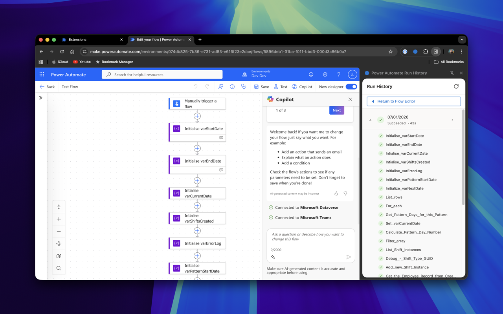

# Flow Run Buddy

<p align="center">
  
</p>

A Chrome extension that displays run history for Power Automate Cloud Flows directly from the flow designer.

[](https://chromewebstore.google.com/detail/flow-run-buddy/gohhkaenioblnjajjpbojjkebdmipebd)

## Screenshots

<p align="center">
  
</p>

<p align="center">
  
</p>

<p align="center">
  
</p>

## Features

- **Side panel UI** - View run history alongside the flow designer
- **Last 10 runs** - Quick access to recent flow executions
- **Run details** - Status, timestamp, and duration for each run
- **Expandable steps** - Click to expand any run and see individual action results
- **Inline error details** - When a run fails, expand it to see the flow-level failure message and step errors directly in the panel
- **One-click navigation** - Click any run to view its full details
- **Double-click to open** - Double-click a run row to navigate to run details
- **Configurable tab behavior** - Choose whether flow runs open in a new tab or current tab (set during initial walkthrough or change anytime via footer preference)
- **Return to editor** - Quick button to return to the flow editor after viewing a run
- **Save and Run** - From the side panel, save the flow in the designer and immediately start a new run (uses the Flow Management API after a successful save). If the active tab is on run history instead of the canvas, the extension switches you to the editor first, then saves and triggers. Works best with flows that have a **Manual** or **HTTP** trigger so a trigger URI is available
- **Export run history** - Export the last 10 runs as an Excel workbook (.xlsx) with a summary sheet and individual tabs per run showing all flow steps, including action inputs and outputs. Summary rows link directly to each run's sheet via hyperlinks
- **Export flow definition** - Download the complete flow definition as JSON for backup, documentation, or migration
- **Auto-detection** - Automatically detects when you're viewing a flow
- **Power Apps support** - Detects flows opened in Power Apps and offers redirect to Power Automate
- **Follows active tab** - Side panel automatically reloads when you switch tabs, so it always reflects the currently active flow
- **Dark mode** - Toggle between light and dark themes from the side panel header; your preference is remembered across sessions
- **Feedback link** - "Have an issue or feature request?" footer links directly to GitHub Issues with a prepopulated template

## Installation

### Chrome Web Store (Recommended)

Install directly from the [Chrome Web Store](https://chromewebstore.google.com/detail/flow-run-buddy/gohhkaenioblnjajjpbojjkebdmipebd).

### Manual / Developer Install

1. Clone or download this repository
2. Open Chrome and navigate to `chrome://extensions/`
3. Enable **Developer mode** (toggle in top right)
4. Click **Load unpacked**
5. Select the extension folder

## Usage

1. Navigate to a Power Automate flow in the designer at `make.powerautomate.com`
2. Click the extension icon in the toolbar to open the side panel
3. On first use, complete the interactive walkthrough to learn key features and set your preference for how flow runs should open (new tab or current tab)
4. View the run history for the current flow
5. Click the expand button (▼) on any run to see individual step results
6. Double-click a run or click the chevron (›) to navigate to the run detail page
7. Use the "Return to Flow Editor" button to go back to the flow designer
8. Click **Save and Run** (next to Return to Flow Editor) to save your changes in the designer and trigger the flow in one step; the run list refreshes when it succeeds
9. Use the refresh button to reload the run list
10. Click the **Export** dropdown in the header to export run history as Excel or the flow definition as JSON
11. To change your tab preference later, click "Change" in the preference footer at the bottom of the panel

When you switch to a different tab, the side panel will automatically refresh to show the context and run history (if available) for the newly active tab.

**Note:** You must be signed in to Power Automate in your browser for the extension to work.

### Power Apps Users

If you open a flow from Power Apps (`make.powerapps.com`), the extension will display a message with a button to open the same flow in Power Automate, where full run history functionality is available.

## How It Works

The extension detects when you're on a Power Automate flow designer page by matching URL patterns:
```
https://make.powerautomate.com/environments/{environmentId}/flows/{flowId}/*
https://make.powerautomate.com/environments/{environmentId}/flows/shared/{flowId}/*
```

It then fetches run history from the Power Automate API using your existing browser session credentials.

The extension is built using standard Chromium extension APIs (Manifest V3) and works in both Google Chrome and Microsoft Edge (Chromium-based) when sideloaded or installed from the respective stores.

## Files

| File             | Description                                       |
| ---------------- | ------------------------------------------------- |
| `manifest.json`  | Extension configuration (Manifest V3)             |
| `background.js`  | Service worker for API calls and token management |
| `content.js`     | Detects flow context from page URL                |
| `sidepanel.html` | Side panel UI structure                           |
| `sidepanel.js`   | Side panel logic and rendering                    |
| `sidepanel.css`  | Styling                                           |
| `lib/`           | Third-party libraries (SheetJS for Excel export)  |
| `icons/`         | Extension icons (16, 48, 128px)                   |

## Permissions

- `activeTab` - Access to the current tab
- `sidePanel` - Display the side panel UI
- `storage` - Store extension state
- `scripting` - Extract authentication tokens from the page

## License

MIT
